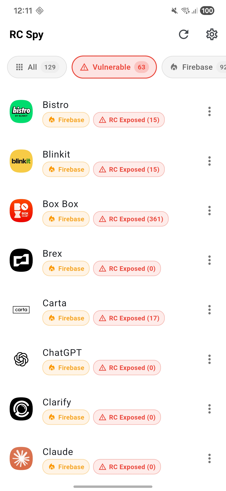
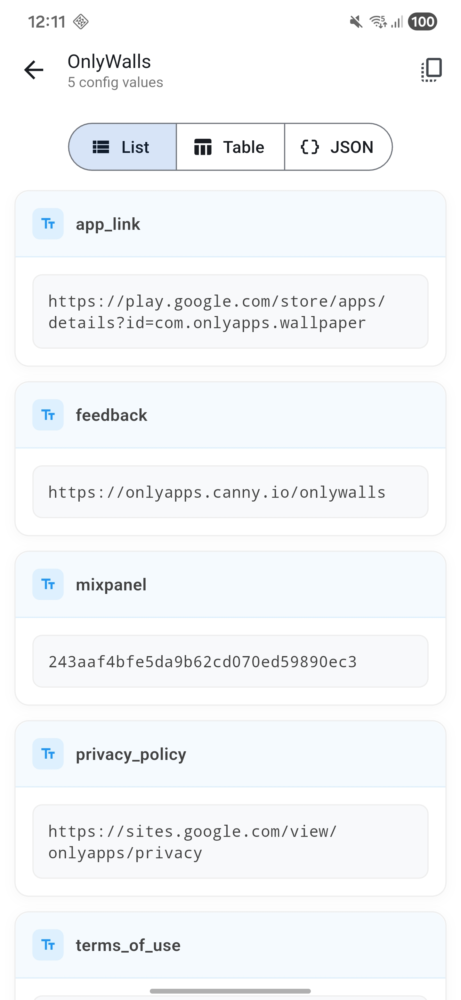
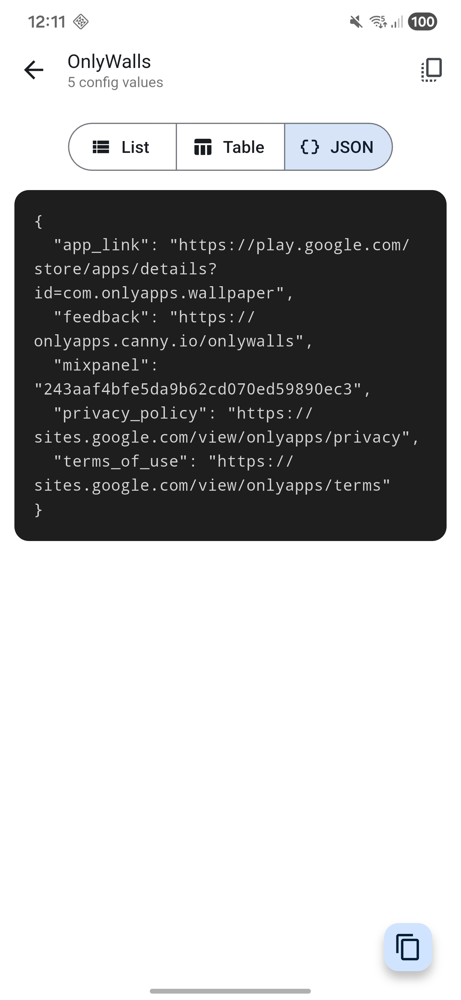
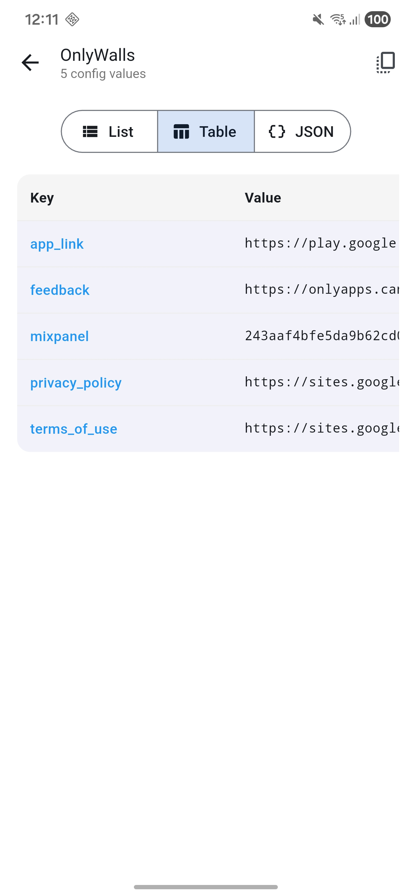
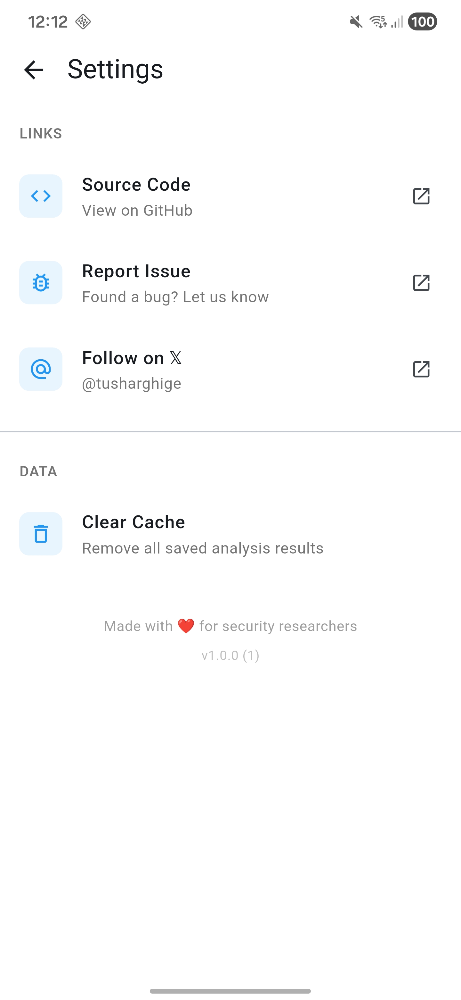

# RC Spy - Firebase & Supabase Security Scanner

  
  
  
  

RC Spy is a security tool that scans installed Android apps to detect backend misconfigurations. It identifies exposed Firebase Remote Config endpoints and Supabase instances with insecure storage buckets or tables. The tool extracts credentials from APKs (including Flutter apps) and tests for vulnerable endpoints. Built using the [Flutter](https://flutter.dev/) framework.

## Features

### Firebase Detection
- **APK Analysis** — Extracts Firebase credentials (App IDs & API Keys) from installed apps
- **Vulnerability Detection** — Checks if Remote Config endpoints are publicly accessible
- **Multiple Views** — View exposed configs in List, Table, or raw JSON format

### Supabase Detection
- **Credential Extraction** — Finds Supabase project URLs and API keys
- **Smart JWT Validation** — Validates JWT tokens to ensure they're actually Supabase keys (not Auth0, Firebase Auth, etc.)
- **Key Format Support** — Detects both old JWT format (`eyJ...`) and new format (`sb_publishable_...`)
- **Security Analysis** — Tests for exposed storage buckets and database tables
- **Schema Discovery** — Automatically discovers tables via PostgREST OpenAPI schema
- **Multiple Views** — View exposed data in List, Table, or raw JSON format (unified with Firebase UI)

### General
- **Flutter App Support** — Scans native libraries (`.so` files) where Flutter stores compiled strings
- **Smart Filtering** — Filter by All, Vulnerable, Firebase, Supabase, Secure, or No Backend
- **Search** — Quick search to find apps by name
- **Manual Scan Mode** — Start scanning when you're ready with the "Start Scan" button
- **Local Caching** — Results persist across app launches
- **Fast Scanning** — Parallel analysis using isolates for smooth performance
- **Share Results** — Export and share analysis findings

## How it looks

  <kbd></kbd>
  <kbd></kbd>
  <kbd></kbd>

 

  
See full screenshots

  

  <kbd></kbd>
  <kbd></kbd>
  <kbd></kbd>
  

   

  

    <kbd></kbd>
    <kbd></kbd>
  

## Use Cases

- Security researchers auditing app configurations
- Penetration testers identifying misconfigurations
- Developers checking their own apps for vulnerabilities
- Bug bounty hunters looking for exposed backends

## Built With

- Flutter & Dart
- Provider for state management
- Isolates for background processing

## Disclaimer

This tool is intended for **security research and educational purposes only**. Only scan apps you have permission to analyze. The developer is not responsible for any misuse of this tool.

## License

This project is licensed under the **GNU General Public License v3.0** — see the [LICENSE](LICENSE) file for details.

---

Made with love for security researchers

  <a href="https://x.com/tusharghige">Follow me on X</a>

